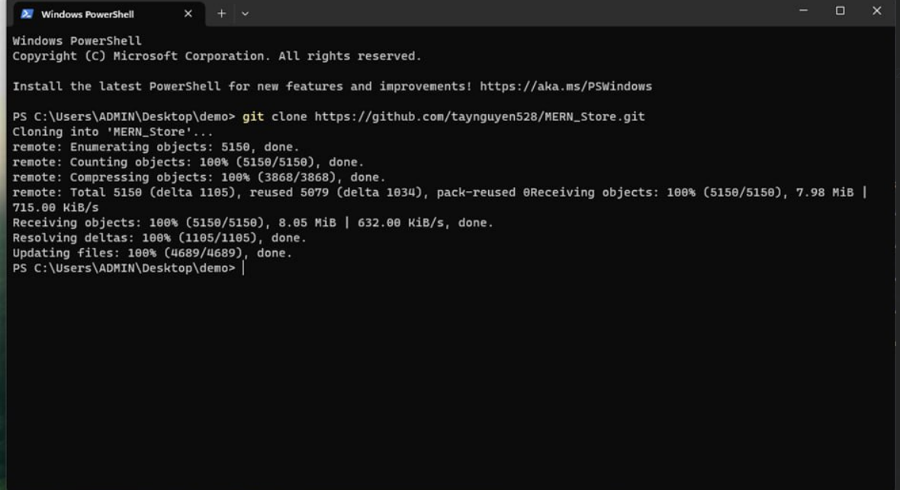
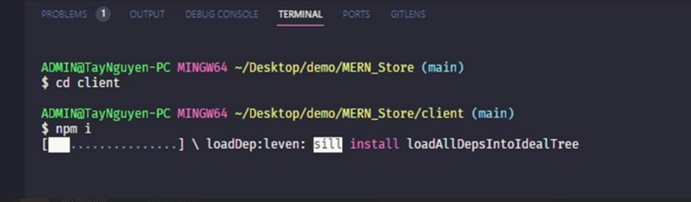
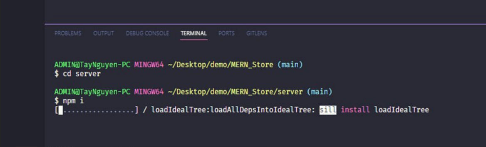
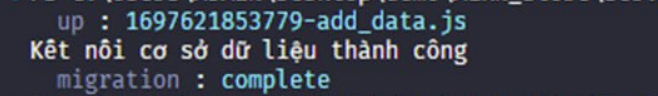

# Tiểu luận chuyên ngành

# Đề tài web bán đồ thể thao

# Thành viên nhóm:

# Phạm Trịnh Tây Nguyên 20110528

# Phan Nguyễn Hoài Nam 20110080

# Công nghệ sử dụng: MongoDB, Express, ReactJS, Node

# Cách cài đặt:

# Truy cập link github: https://github.com/taynguyen528/MERN_Store. Coppy link github của dự án.

# Mở terminal ở 1 foldel bất kì và chạy lệnh:

git clone https://github.com/taynguyen528/MERN_Store.git

# Mở VSCode và vào 2 folder client và server của dự án chạy lệnh npm:

# Mở thêm 1 powersell và chạy lệnh : migrate -d mongodb://0.0.0.0:27017/MERN_Store up add_data để kết nối db

# Sau khi có thông báo kết nối thành công: ở folder server chạy lệnh: node server js. Ở folder client chạy lệnh npm start để khởi chạy chương trình.

# Giao diện chính của trang web:

# Giao diện sản phẩm ở các danh mục:

# Giao diện trang sản phẩm chi tiết:

# Giao diện trang giỏ hàng:

# Ghi chú thông tin đơn hàng và cách thanh toán:

# Xem chi tiết đơn hàng đã đặt

