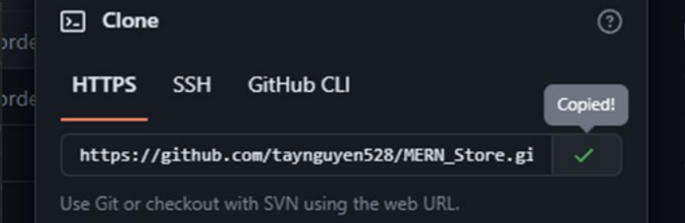
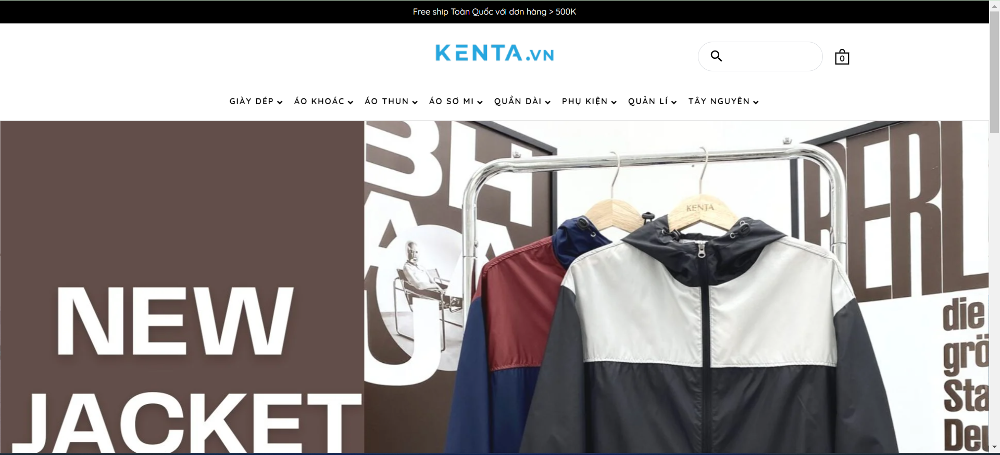
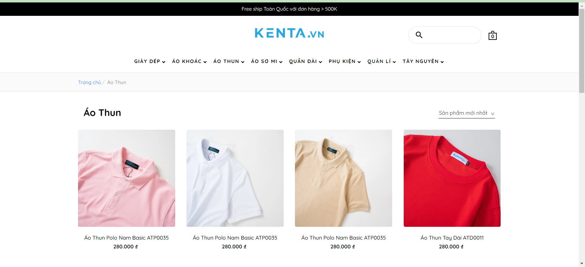
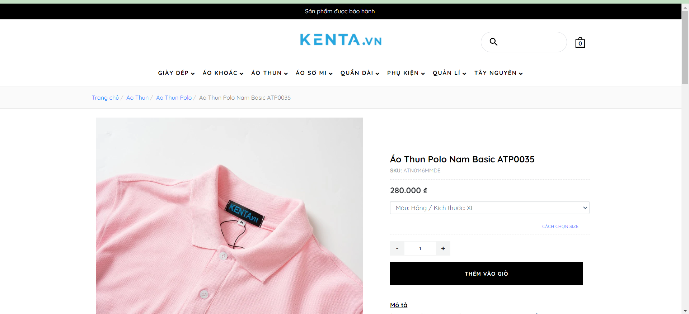
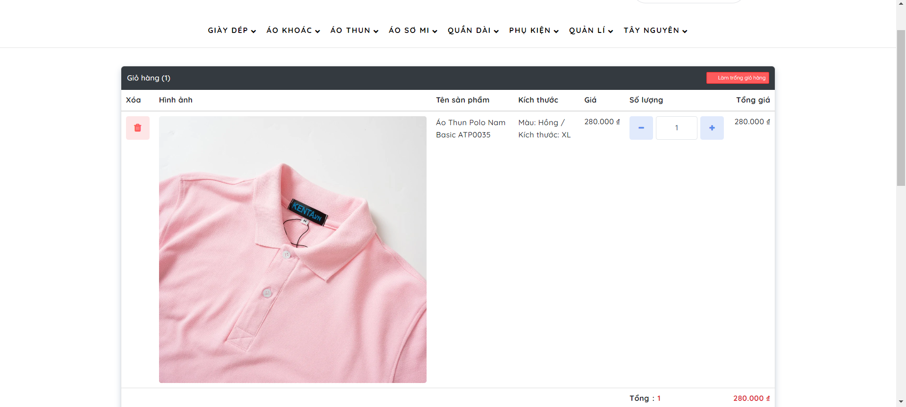
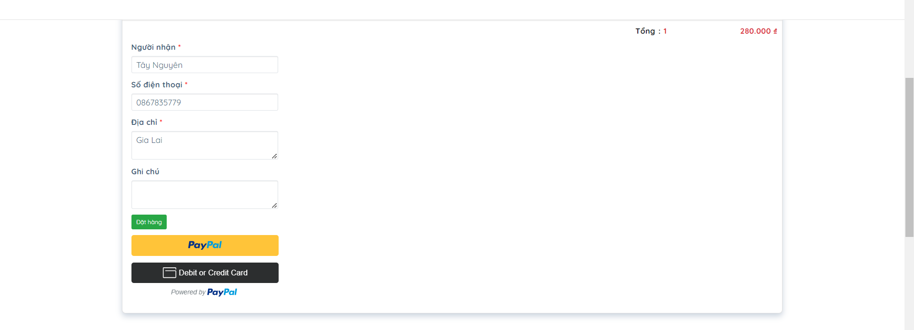
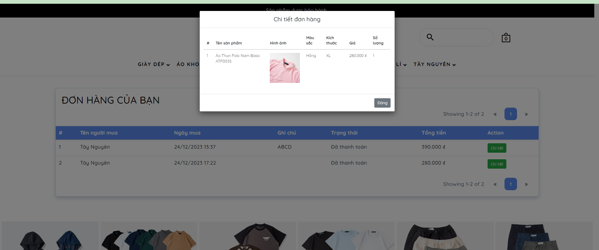

# Tiểu luận chuyên ngành

# Đề tài web bán đồ thể thao

# Thành viên nhóm:

# Phạm Trịnh Tây Nguyên 20110528

# Phan Nguyễn Hoài Nam 20110080

# Công nghệ sử dụng: MongoDB, Express, ReactJS, Node

# Cách cài đặt:

Truy cập link github:
https://github.com/taynguyen528/MERN_Store
Coppy link github của dự án.

# Giao diện chính của trang web:

# Giao diện sản phẩm ở các danh mục:

# Giao diện trang sản phẩm chi tiết:

# Giao diện trang giỏ hàng:

# Ghi chú thông tin đơn hàng và cách thanh toán:

# Xem chi tiết đơn hàng đã đặt

